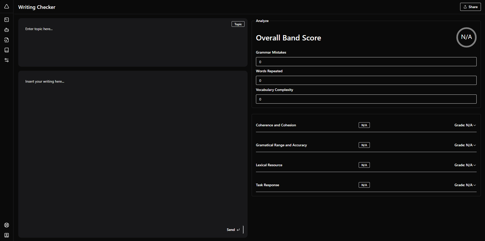

# IELTS Writing Checker
Check your essay based on the original IELTS rubric.

## Server Functions

The server is built using Quart, a Python ASGI web microframework. It also uses the Quart-CORS extension to handle Cross-Origin Resource Sharing (CORS), allowing the client to communicate with the server.

### Main Functions

- `setup_prompt(trait, description)`: This function sets up the prompt for the AI model. It takes a trait and its description as arguments and returns a string that instructs the AI to evaluate the essay based on the given trait.

- `retrieve_quotations(prompt, essay, trait)`: This function generates a task for the AI model to retrieve quotations from the essay that are relevant to the given trait. It returns a string that instructs the AI to list and evaluate relevant quotations.

- `score_trait(quotations, trait, scoring_criteria)`: This function generates a task for the AI model to score the essay based on the given trait. It takes the quotations retrieved by the AI, the trait, and the scoring criteria as arguments, and returns a string that instructs the AI to score the trait based on the provided quotations and criteria.

- `send_prompt(client, model, messages)`: This is an asynchronous function that sends a prompt to the AI model and retrieves its response. It takes the Groq client, the model name, and the messages to send as arguments. It returns the AI's response as a string.

- `evaluate_trait(client, model, prompt, essay, trait, description, criteria)`: This is an asynchronous function that evaluates a single trait of the essay. It uses the `send_prompt` function to communicate with the AI model. It returns the score given by the AI for the trait.

- `evaluate_essay(api_key, model, prompt, essay, traits, descriptions, criteria_list)`: This is an asynchronous function that evaluates the entire essay. It uses the `evaluate_trait` function to evaluate each trait of the essay. It returns a dictionary where the keys are the traits and the values are the scores given by the AI.

### Routes

- `@app.route('/api/evaluate', methods=['POST'])`: This is the main route of the server. It handles POST requests at the `/api/evaluate` endpoint. When a request is received, it retrieves the essay and topic from the request data, evaluates the essay using the `evaluate_essay` function, and returns the scores as a JSON object.

## Client
Frontend made with Next.js.
